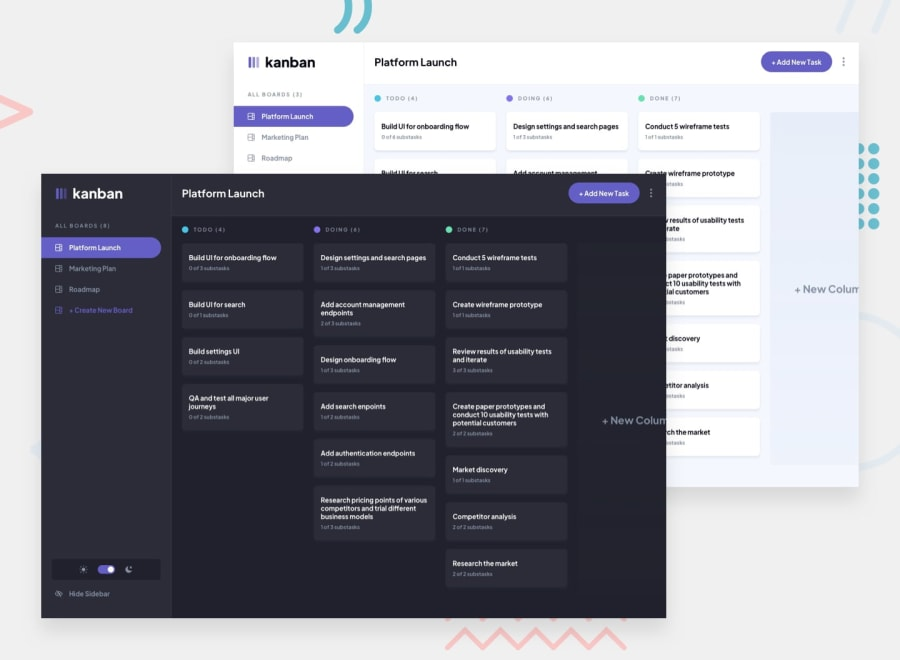

# Kanban Task Management App 

This is a solution to the [Kanban task management web app challenge on Frontend Mentor](https://www.frontendmentor.io/challenges/kanban-task-management-web-app-wgQLt-HlbB). Frontend Mentor challenges help you improve your coding skills by building realistic projects. 

## Table of contents

- [Overview](#overview)
  - [The challenge](#the-challenge)
  - [Screenshot](#screenshot)
  - [Links](#links)
- [My process](#my-process)
  - [Built with](#built-with)
  - [What I learned](#what-i-learned)
- [Author](#author)

## Overview

### The challenge

Users should be able to:

- View the optimal layout for the app depending on their device's screen size
- See hover states for all interactive elements on the page
- Create, read, update, and delete boards and tasks
- Receive form validations when trying to create/edit boards and tasks
- Mark subtasks as complete and move tasks between columns
- Hide/show the board sidebar
- Toggle the theme between light/dark modes

### Screenshot

### Links

- Live Site URL: [https://antcodev.ca/p-kanban](https://antcodev.ca/p-kanban)

## My process

### Built with

- Semantic HTML5 markup
- CSS custom properties
- Flexbox
- CSS Grid
- Mobile-first workflow
- [React](https://reactjs.org/) - Frontend JS library
- [Redux](https://redux.js.org/) - Frontend JS library
- [Node](https://nodejs.org/en/) - Backend JS library
- [MongoDB](https://www.mongodb.com/) - NoSQL Database

### What I learned

- This is my first full-stack project, utilizing an Express / MongoDB backend. I had made
  an E/M backend before but not as part of a full project.
- Learned about backend hosting

## Author

- [My Portfolio](https://antcodev.ca)
